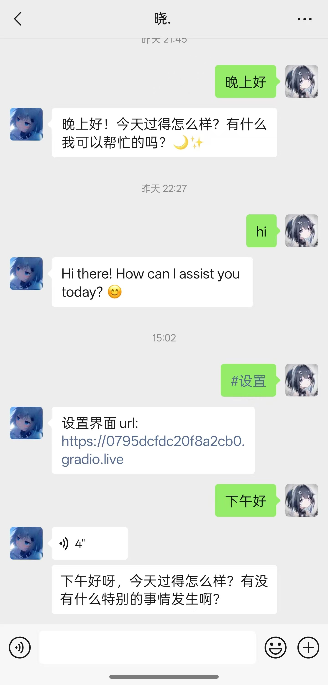
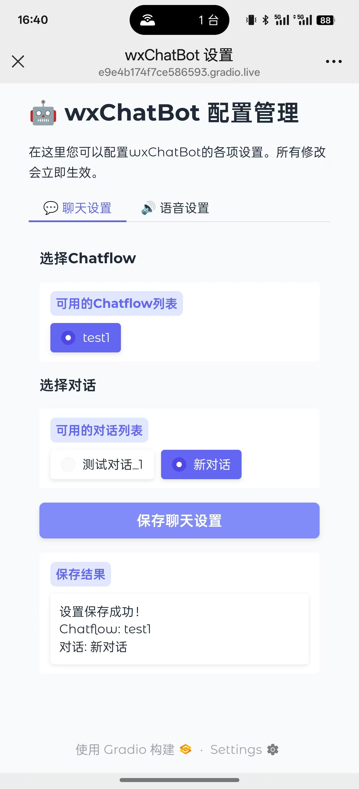
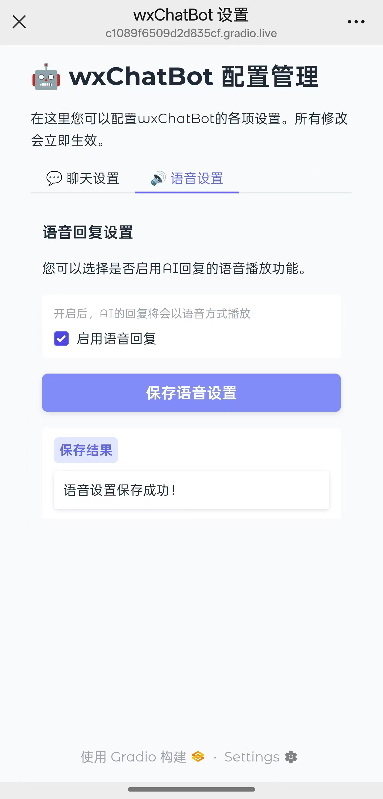
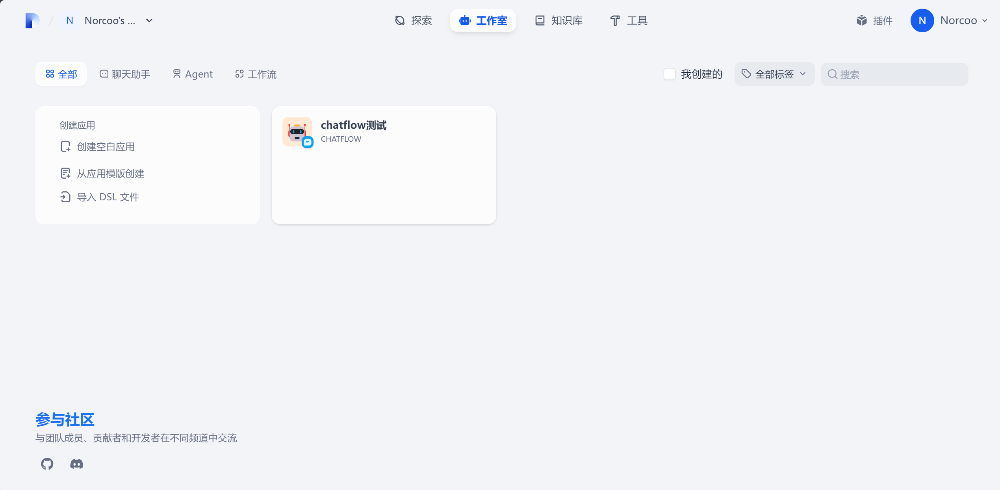
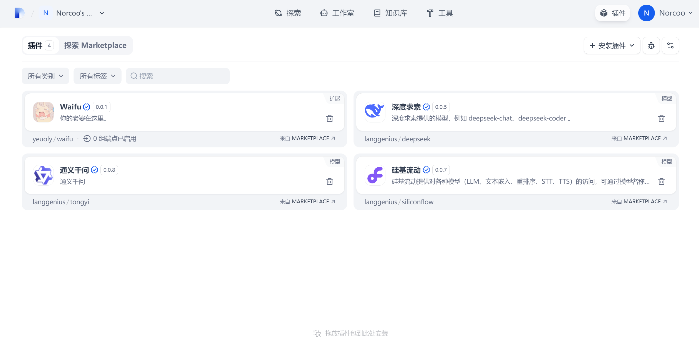
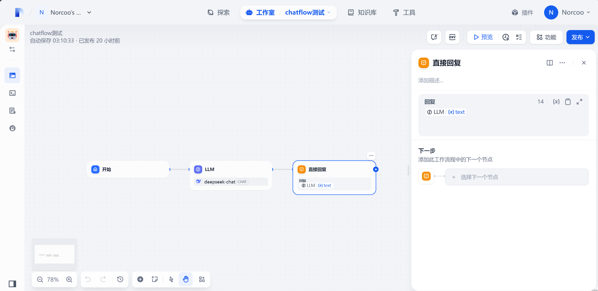
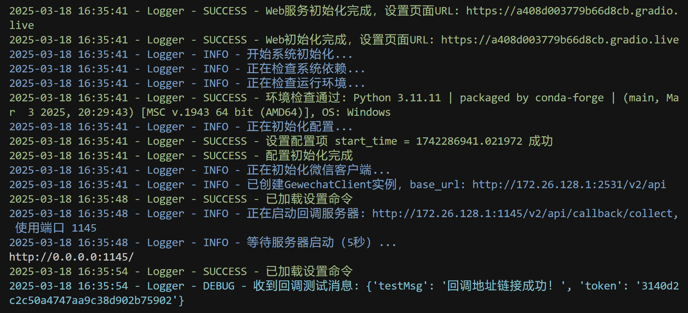

# wxChatBot

---

<div align="center">
  <p>⭐️ 如果这个项目对你有帮助，欢迎点个Star支持一下！ ⭐️</p>
</div>

---

<div align="center">


</div>

<div align="center">
  <a href="README.md">中文</a> | 
  <a href="docs/en/README.md">English</a>
</div>

<p align="center">wxChatBot 是一个基于Dify和Gewechat开发的智能聊天机器人项目。它通过集成 Dify AI 平台，提供高效、智能的消息处理和自动回复服务。支持ChatFlow自定义编排AI任务，原生支持永久记忆功能，支持GPT-SoVITS自定义音色，能够发送原生微信语音气泡</p>

<div align="center" style="display: flex; justify-content: center; flex-wrap: nowrap; gap: 10px; max-width: 100%; overflow-x: auto;">
  
  
  
</div>
<p align="center"><b>微信聊天演示 | ChatFlow功能配置界面 | 语音设置界面</b></p>

## 👋 前言唠唠嗑

哈喽！欢迎,欢迎~
这个项目最初是受到 [dify-on-wechat](https://github.com/hanfangyuan4396/dify-on-wechat) 的启发

在部署过程中，我发现了几个需要改进的地方：
- ChatFlow 功能支持有限
- 本地部署时微信回调地址连接不稳定（尤其是没有公网IP的情况）
- 语音模型只能调用一些大厂预制API，定制音色麻烦

于是我集成了 GPT-SoVITS，实现了自定义语音音色的功能。这样用户可以根据自己的需求定制专属音色

其次是为什么选择Gewechat?
当然是稳定且功能强大了！相较于itchat和wxauto，Gewechat实现微信个人号通道,使用ipad协议登录,相比itchat协议更稳定。
wxauto不支持发送语音气泡，虽然稳定性强，但是很多可个性化的地方支持的不够完善。

未来计划添加更多功能：
- 📄 文档上传与智能问答
- 🎬 视频图片识别处理
- 🎨 多媒体内容生成

理论上，Dify支持的功能都可以整合进来。这个项目可以变成：
- 📚 专属知识库助手
- 📝 个人生活管理工具
- 📊 股票分析(仅作参考)

这主要归功于Dify，它负责复杂的AI处理，而本项目专注于接收和发送结果

我希望这个项目对新手也比较友好，但目前确实需要一定的技术基础。如果你成功部署了，希望你能从中学到有用的知识

废话不多说，玩的开心~

## ✨ 功能特性

### 🤖 Dify集成
- 支持Dify的ChatFlow功能，提供Agent构建、AI工作流编排、RAG检索、模型管理等能力
- 简化生成式AI应用的构建和运营，大部分Dify功能都可集成
- 内置永久记忆和本地知识库检索功能
- 支持插件和自定义函数扩展

<div align="center">
  
  <p><b>Dify主页面</b></p>
  
  
  <p><b>模型配置界面</b></p>
  
  
  <p><b>ChatFlow工作流配置</b></p>
</div>

### 📱 微信集成
- 无缝对接个人微信，轻松接入微信生态
- 支持文本和语音回复（原生语音泡，非文件形式）
- 通过简单指令（如`#设置`）获取管理界面

### 🔊 语音功能
- 基于GPT-SoVITS技术，支持自定义语音模型
- 少量语音样本即可高度还原声音特征
- 支持语音与文本互转功能
- 可配置多种语音参数，实现个性化语音体验

### ⚙️ 系统功能
- 基于Gradio开发的Web管理界面，配置简单直观
- 支持Gradio的share=True模式，无需公网IP即可远程访问
- 项目结构清晰，便于自定义和二次开发
- 完整的日志记录与监控系统

## 📁 项目结构

```
wxChatBot/
├── Core/                  # 核心功能模块
│   ├── bridge/            # 通信桥接层
│   ├── commands/          # 命令系统
│   ├── difyAI/            # Dify AI集成
│   ├── factory/           # 服务工厂
│   ├── voice/             # 语音处理模块
│   └── web/               # Web管理界面
├── gewechat/              # 微信API集成
│   ├── api/               # API接口封装
│   ├── util/              # 工具接口层
│   └── data/              # 数据存储
├── voice_model/           # 语音模型文件
├── logs/                  # 日志文件
├── tmp/                   # 临时文件目录
├── config.py              # 配置管理
├── main.py                # 主程序入口
├── config.example.json    # 配置文件示例
└── requirements.txt       # 项目依赖
```

## 🚀 快速开始

### 环境要求
- Python 3.11+
- 一个实名认证的微信账号（建议开通钱包功能并充值少量金额，使用独立设备运行更稳定）
- Dify的Docker环境
- Gewechat的Docker环境

### 视频教程
- 在做了，在做了

### 安装步骤

#### 1. 克隆仓库
```bash
git clone https://github.com/yourusername/wxChatBot.git
cd wxChatBot
```

#### 2. 安装依赖
```bash
pip install -r requirements.txt
```

#### 3. 修改配置文件（见下方配置说明）
```bash
# 编辑config.json填入必要信息
config.json
```

#### 4. 通过Docker构建Dify (可参考: [Dify](https://github.com/langgenius/dify))
```bash
git clone https://github.com/langgenius/dify.git
cd dify
cd docker
cp .env.example .env
docker compose up -d
```

#### 5. 通过Docker构建GeweChat (可参考: [Gewechat](https://github.com/Devo919/Gewechat))
##### 5.1 拉取镜像
```bash
docker pull registry.cn-hangzhou.aliyuncs.com/gewe/gewe:latest
docker tag registry.cn-hangzhou.aliyuncs.com/gewe/gewe gewe
```

##### 5.2 运行镜像容器
```bash
mkdir -p /root/temp
docker update --restart=always gewe
docker run -itd -v /root/temp:/root/temp -p 2531:2531 -p 2532:2532 --privileged=true --name=gewe gewe /usr/sbin/init
```

##### 5.3 将容器设置成开机运行
```bash
docker update --restart=always gewe
```

#### 6. 启动项目主程序
```bash
python main.py
```

启动成功后控制台输出如下:
<div align="center">

<p><b>系统启动界面</b></p>
</div>


## ⚙️ 配置说明

初次运行，需要修改`config.json`文件，主要配置项包括：

```bash
{
    "master_name": "", # 你的微信账号名称(注意是账号名称不是备注，建议使用不易重名的名称)
    "dify_api_base": "http://localhost/v1", # dify的地址，一般不用修改
    "gewechat_base_url": "http://your_local_ip:2531/v2/api", # 将your_local_ip替换为你的电脑IP地址
    "gewechat_token": "", # 初次创建应用，留空，这里自动填写
    "gewechat_app_id": "", # 初次创建应用，留空，这里自动填写
    "gewechat_callback_url": "http://your_local_ip:1145/v2/api/callback/collect", # 一般不需要改
    "server_host": "localhost", # 应该也不需要修改
    "settings_url": "", # 自动生成
    "GPT-SoVITS_url": "http://127.0.0.1:9880", # GPT-SoVITS的url,一般默认即可
    "text_language": "ja", # 模型发送的语音语言(如果为中文之外的语言，需要在Dify端修改提示词)常用的:中文(zh),英文(en),日文(ja)
    "call_back_success_falg": false, # 推荐设置为false，这样会少很多莫名其妙的bug
    "is_remote_server": false, # 是否为远程服务器，本地部署的就填false
    "debug_mode": true, # 可以不改
    "log_level": "DEBUG", # 可以不该
    "start_time": 1742287344.8490422 # 自动生成
}
```

> 💡 **提示**：参考项目中的`config.example.json`获取完整配置示例


## ❗注意事项

### 💡 微信回调配置
- 首次运行时，系统会自动配置Gewechat的回调地址
- 新设备在次日凌晨可能会自动掉线（微信安全机制）
- 解决方案：
  1. 将`config.json`中的`call_back_success_falg`设为`false`
  2. 重新扫码登录
  3. 登录成功后将`call_back_success_falg`改回`true`
- 如果不介意每次都扫码，可以保持`false`状态，避免回调地址出现问题

### ❗Gewechat创建失败(作者在这里踩了许多坑了)
如果遇到gewechat创建设备失败，unexpected EOF错误，请排查网络是否是以下情况：
```bash
1️. 代理：请关闭代理后尝试；

2️. 国外服务器；

3️. 回调地址为外网；

4️. 异地服务器
```

### 🛠️ 环境依赖
- **Dify环境**：必须确保Dify正确部署，这是使用大模型能力的基础
- **GPT-SoVITS**：如需语音功能，请先完成部署
  - Windows用户推荐使用[GPT-SoVITS整合包](https://github.com/RVC-Boss/GPT-SoVITS?tab=readme-ov-file)
  - 其他系统请参考官方文档部署
- **本地模型**：支持使用LM Studio或Ollama部署本地模型
  - 在Dify模型配置界面中选择对应选项
  - 可根据需求进行深度定制

### 📦 FFmpeg安装指南
根据您的操作系统选择合适的安装方式：

<details>
<summary><b>Windows 系统</b></summary>

```bash
# 方式1：使用Anaconda
conda install -c conda-forge ffmpeg

# 方式2：使用Chocolatey
choco install ffmpeg
```
</details>

<details>
<summary><b>Linux 系统</b></summary>

```bash
# Ubuntu/Debian
sudo apt update && sudo apt install ffmpeg

# CentOS/RHEL
sudo yum install ffmpeg
```
</details>

<details>
<summary><b>macOS 系统</b></summary>

```bash
# 使用Homebrew
brew install ffmpeg
```
</details>

> ⚠️ **重要提示**：
> - 推荐使用Anaconda环境，实测这样安装更加简单
> - 安装完成后请确保FFmpeg已添加到系统环境变量
> - 如遇到"路径不存在"错误，请检查环境变量配置
> - Windows用户可在系统变量Path中添加FFmpeg所在目录

## 📊 主要依赖

| 依赖包 | 版本 | 用途 |
|-------|------|------|
| `gradio` | 5.21.0 | Web界面框架，用于构建设置页面 |
| `web.py` | 0.62 | Web服务框架，处理回调和API请求 |
| `pyngrok` | 7.2.3 | 内网穿透工具，用于远程访问 |
| `requests` | 2.32.3 | HTTP请求库，用于与各服务通信 |
| `ffmpeg-python` | 0.2.0 | 音频格式转换，处理语音消息 |
| `pilk` | 0.2.4 | 微信语音编码处理 |
| `pysilk` | 0.0.1 | SILK格式音频处理 |
| `qrcode` | 7.4.2 | 二维码生成，用于微信登录 |
| `coloredlogs` | 15.0.1 | 日志美化，提供彩色日志输出 |
| `tqdm` | 4.67.1 | 进度条显示，优化用户体验 |

> 💡 **安装提示**：
> - 建议使用Anaconda环境安装依赖：
>   ```bash
>   conda create -n wxchatbot python=3.11
>   conda activate wxchatbot
>   # 确保当前在项目路径下
>   pip install -r requirements.txt
>   ```
> - 某些依赖（如 gradio）会自动安装其他必要的包
> - 确保系统已安装 FFmpeg（参考上方安装指南）

## 🚀 开发计划

### 近期计划
- [x] 完善ChatFlow相关功能
- [x] 优化Web设置界面
- [x] 微信发送语音开关
- [ ] 正式发布V1.0.0版本
- [ ] Docker一键部署
- [ ] 视频教程

### 后期计划
- [ ] 可设置的主动发送消息功能
- [ ] 用户可设置(自定义)在一定时间段内多次发送消息，Dify那边能够一次性处理
- [ ] 批处理操作(针对需要多次执行的指令)
- [ ] 增加web端的功能(支持新建对话、删除对话、修改提示词等等)
- [ ] 表情包发送
- [ ] 支持群聊
- [ ] 支持文档上传及处理
- [ ] 支持视频、图片识别等
- [ ] 用户可以发送语音
- [ ] QQ移植
- [ ] 长文本网页markdown渲染


## ❤️ 赞助支持

### 💝 支持我
你的支持是持续改进这个项目的动力！

<div align="center">
🎯 你的支持将用于：
</div>
<div align="center">
🎓 制作开源教程和文档 · 💡 开发更多实用功能 · 🌍 建设开源社区 · 🔥 探索AI应用新可能
</div>
<div style="display: flex; justify-content: center; align-items: center; gap: 40px; margin: 20px 0;">
  <div style="text-align: center;">
    
    <p><b>微信支付</b></p>
  </div>
  <div style="text-align: center;">
    
    <p><b>支付宝</b></p>
  </div>
</div>

### 🔒 赞助计划

<table>
  <thead>
    <tr>
      <th width="33%">🎯 基础服务</th>
      <th width="33%">🌟 进阶服务</th>
      <th width="33%">💎 专属服务</th>
    </tr>
  </thead>
  <tbody>
    <tr>
      <td>
        <div style="padding: 5px 0;">
          📱 私有化部署方案<br>
          🔧 远程指导安装与配置<br>
          💻 问题解决与故障排查
        </div>
      </td>
      <td>
        <div style="padding: 5px 0;">
          🤖 AI模型私有化部署与调优<br>
          🎨 定制对话流程与场景<br>
          📊 专属知识库构建
        </div>
      </td>
      <td>
        <div style="padding: 5px 0;">
          📘 源码深度解析<br>
          🛠️ 项目二次开发技术咨询<br>
          💡 方案应用定制
        </div>
      </td>
    </tr>
  </tbody>
</table>

<div align="center" style="margin: 20px 0; padding: 10px; background-color: #f8f9fa; border-radius: 5px;">
  <p><b>💼 商务合作/赞助咨询：</b>微信 <code>Norcoo</code> （备注：wxChatBot）</p>
</div>

## 💬 核心交流群

| 群类型 | 群号 | 状态 |
|--------|------|------|
| ✨ 交流群 | 953715009 | ✅ 已开放 |
| 🎁 赞助群 | 1040728529 | ✅ 已开放 |

## 🤝 贡献指南

感谢你对项目的关注！欢迎各种形式的贡献

### 🌟 贡献方式

1. 🐛 **问题反馈**
   - 详细描述遇到的问题
   - 提供复现步骤和相关日志
   - 说明运行环境和相关配置

2. 💡 **功能建议**
   - 描述新功能的用途和应用场景
   - 提供设计思路或参考实现
   - 分享使用过程中的想法

3. 📝 **文档改进**
   - 修正文档中的错误
   - 补充安装和配置说明
   - 添加使用示例和最佳实践
   - 翻译文档到其他语言

4. 💻 **代码贡献**
   - 修复已知bug
   - 开发新功能
   - 优化性能
   - 重构代码结构

### 🎯 开发指南

- 项目代码完善后将提供详细的开发指南

### 🔄 更新日志

**2025-03-19**
- 完善README文档内容和排版

**2025-03-17**
- 优化图片排版，添加英文文档支持
- 增加配置文件示例
- 添加项目介绍和示例图片
- GPT-SoVITS连接成功，实现自定义语音生成
- 实现微信语音消息发送功能

**2025-03-12**
- 初始项目框架搭建
- 基础功能测试

## 📄 许可证

本项目使用 MIT 许可证。详情请参阅 [LICENSE](LICENSE) 文件

## 🌟 致谢

感谢以下开源项目的支持：

- [Dify](https://dify.ai) - 提供强大的AI能力支持
- [dify-on-wechat](https://github.com/hanfangyuan4396/dify-on-wechat) - 项目灵感来源
- [Gewechat](https://github.com/Devo919/Gewechat) - 微信接口实现
- [GPT-SoVITS](https://github.com/RVC-Boss/GPT-SoVITS) - 语音合成技术支持

## 📜 项目声明
- 本项目仅供技术研究与学习交流
- 禁止用于任何违法或不道德的场景
- 生成内容不代表开发者立场和观点
- 使用者需对自身行为负责
- 开发者不对因使用本项目产生的问题承担责任

---

<div align="center">
  <p>如果这个项目对你有帮助，欢迎Star支持！⭐️</p>
</div>
