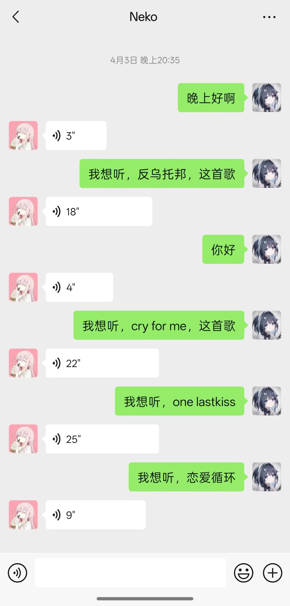
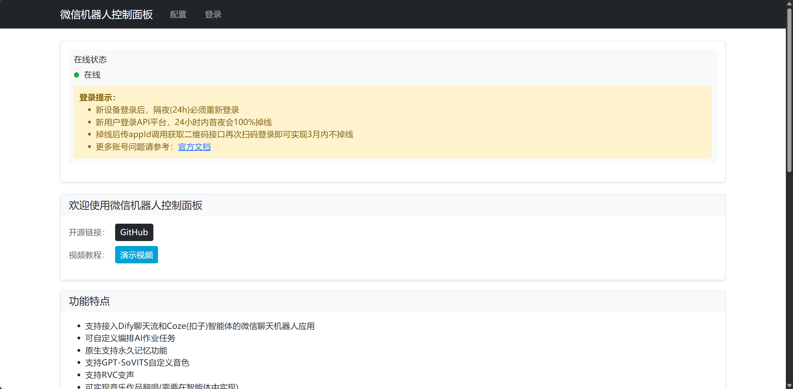
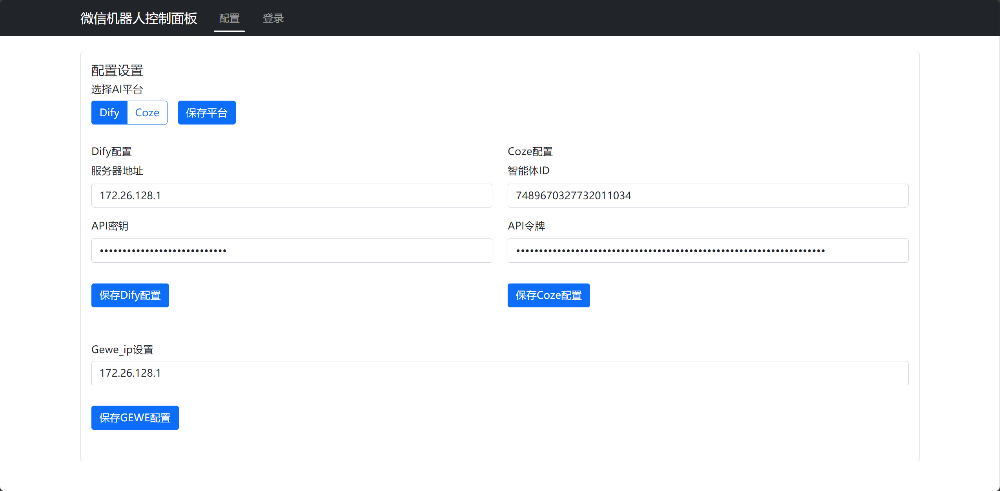
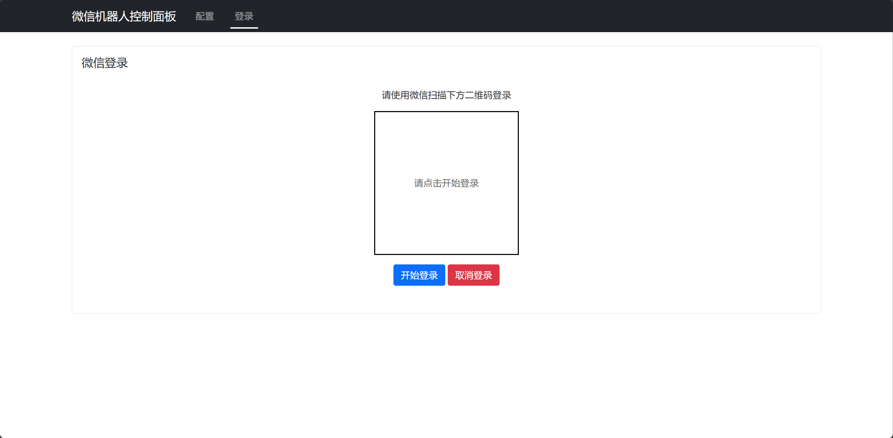

# wxChatBot

---

<div align="center">
  <p>⭐️ 如果这个项目对你有帮助，欢迎点个Star支持一下！ ⭐️</p>
</div>

---

<div align="center">


</div>

<div align="center">
  <a href="README.md">中文</a> | 
  <a href="docs/en/README.md">English</a>
</div>

<p align="center">wxChatBot 是一个基于Dify/Coze和Gewechat开发的智能聊天机器人项目。它通过集成 Dify AI 平台或Coze(扣子)平台，提供高效、智能的消息处理和自动回复服务。支持GPT-SoVITS合成语音，支持RVC变声合成歌曲，根据知识库中的音乐实现AI唱歌</p>

<h2 align="center">🤖 功能展示</h2>

<div align="center" style="display: flex; justify-content: center; flex-wrap: nowrap; gap: 10px; max-width: 100%; overflow-x: auto; margin-bottom: 20px;">
  
  
</div>
<p align="center" style="margin-bottom: 30px;"><b>智能对话演示 | AI歌声合成展示</b></p>

<h2 align="center">💻 界面预览</h2>

<div align="center" style="display: flex; justify-content: center; flex-wrap: wrap; gap: 20px; max-width: 100%; margin-bottom: 40px;">
  <div style="flex: 1; min-width: 300px; max-width: 32%;">
    
    <p style="margin-top: 12px; font-size: 15px;"><b>📊 控制面板</b></p>
    <p style="font-size: 13px; color: #666;">实时监控机器人状态和对话数据</p>
  </div>
  <div style="flex: 1; min-width: 300px; max-width: 32%;">
    
    <p style="margin-top: 12px; font-size: 15px;"><b>⚙️ 配置中心</b></p>
    <p style="font-size: 13px; color: #666;">便捷的AI平台和系统参数配置</p>
  </div>
  <div style="flex: 1; min-width: 300px; max-width: 32%;">
    
    <p style="margin-top: 12px; font-size: 15px;"><b>🔐 登录入口</b></p>
    <p style="font-size: 13px; color: #666;">安全便捷的扫码登录系统</p>
  </div>
</div>

# 🎉 最新发布

## 视频链接:
[视频教程-BiliBili](https://www.bilibili.com/video/BV1emo9YfEzL/?spm_id_from=333.1387.homepage.video_card.click&vd_source=77a30ef3628f2526c0b6e937fe4c217e)

## 整合包下载(带python环境)

[V1.2.0整合包下载-百度](https://pan.baidu.com/s/1pCKptFE_hHmWaiOEa-5O6A)
提取码: 2547

[V1.2.0整合包下载-夸克](https://pan.quark.cn/s/28c03a50178c)
提取码：RUSJ

## ✨ 功能特性

### 🤖 AI平台集成
- 支持Dify和Coze(扣子)两大AI平台
- 可在Web界面轻松切换平台
- 支持实时配置更新
- 安全的微信登录机制（ipad协议登录，请确保使用本地部署的gewechat，云端服务器风险较大）

### 📱 微信集成
- 无缝对接个人微信，轻松接入微信生态
- 支持文本回复
- 通过Web界面管理配置和登录

### ⚙️ 系统功能
- 简洁的Web管理界面，配置简单直观
- 实时在线状态显示

## 📁 项目结构

```
wxChatBot/
├── Core/                  # 核心功能模块
│   ├── api/              # API接口
│   ├── difyAI/           # Dify AI集成
│   └── cozeAI/           # Coze AI集成
├── static/               # 静态资源文件
├── templates/            # Web界面模板
├── config.py            # 配置管理
├── app.py               # Web服务入口
├── main.py              # 主程序入口
└── requirements.txt     # 项目依赖
```

## 🚀 快速开始

### 环境要求
- Python 3.11+
- 一个实名认证的微信账号（建议使用独立设备运行更稳定）
- Dify账号或Coze账号（二选一）
- Gewechat的Docker环境

### 安装步骤

#### 1. 下载整合包
[V1.2.0整合包下载-百度](https://pan.baidu.com/s/1pCKptFE_hHmWaiOEa-5O6A)
提取码: 2547

[V1.2.0整合包下载-夸克](https://pan.quark.cn/s/28c03a50178c)
提取码：RUSJ

#### 2. 检查依赖
双击 `setup.bat` 检查项目依赖

#### 3. 通过Docker构建GeweChat
##### 3.1 拉取镜像
```bash
docker pull registry.cn-hangzhou.aliyuncs.com/gewe/gewe:latest
docker tag registry.cn-hangzhou.aliyuncs.com/gewe/gewe gewe
```

##### 3.2 运行镜像容器
```bash
mkdir -p /root/temp
docker run -itd -v /root/temp:/root/temp -p 2531:2531 -p 2532:2532 --privileged=true --name=gewe gewe /usr/sbin/init
```

##### 3.3 将容器设置成开机运行
```bash
docker update --restart=always gewe
```

#### 4. 启动项目

双击 `start-app.bat` 即可启动项目

#### 5. 进入网页的配置页面，自行配置Dify端、Coze端以及Gewechat的相关配置

#### 6. 扫码登录，结束

## ⚙️ 配置说明

通过Web界面可以配置以下内容：

1. AI平台选择
   - Dify配置：服务器地址和API密钥
   - Coze配置：智能体ID和API令牌

2. Gewe服务器配置
   - 服务器IP地址

## ❗注意事项

### 💡 登录说明
- 新设备登录后，隔夜(24h)必须重新登录
- 新用户登录API平台，24小时内首夜会100%掉线
- 掉线后传appId调用获取二维码接口再次扫码登录即可实现3月内不掉线

### 🔒 安全建议
- 建议使用独立设备运行
- 定期检查在线状态
- 保持配置信息的安全性


## 💬 核心交流群

| 群类型 | 群号 | 状态 |
|--------|------|------|
| ✨ 交流群 | 953715009 | ✅ 已开放 |
| 🎁 赞助群 | 1040728529 | ✅ 已开放 |

## 🤝 贡献指南

感谢你对项目的关注！欢迎各种形式的贡献

### 🔄 更新日志

**2025-04-7**
- 发布V1.2.0版本
- 增加可视化UI，方便进行设置以及扫码登录
- 增加Coze(扣子)智能体支持
- Gewechat请使用本地部署，远程部署(异地)风险较大

**2025-03-29**
- 修复V1.0.0版本整合包环境出错的Bug，使用嵌入式python作为启动引擎
- 初次下载项目需要运行整合包里的setup.py
- 然后执行start-app.bat运行项目
- 注意需要更改settings.json中的配置
- 注意V1.0.0版本需要Dify和Gewechat这两个前置的Docker部署环境

**2025-03-25**
- 完善网页部分的更新处理机制，实现热更改配置，自动刷新
- 新增:可通过网页配置chatflow以及chat记录的增加和删除

**2025-03-19**
- 完善README文档内容和排版

**2025-03-17**
- 优化图片排版，添加英文文档支持
- 增加配置文件示例
- 添加项目介绍和示例图片
- GPT-SoVITS连接成功，实现自定义语音生成
- 实现微信语音消息发送功能

**2025-03-12**
- 初始项目框架搭建
- 基础功能测试

## 📄 许可证

本项目使用 MIT 许可证。详情请参阅 [LICENSE](LICENSE) 文件

## 🌟 致谢

感谢以下开源项目的支持：

- [Dify](https://dify.ai) - 提供强大的AI能力支持
- [dify-on-wechat](https://github.com/hanfangyuan4396/dify-on-wechat) - 项目灵感来源
- [KouriChat](https://github.com/KouriChat/KouriChat) - 提供了很多创新、有趣的思路
- [Gewechat](https://github.com/Devo919/Gewechat) - 微信接口实现
- [GPT-SoVITS](https://github.com/RVC-Boss/GPT-SoVITS) - 语音合成技术支持


## 📜 免责声明
本软件仅供学习和研究使用，请勿用于商业用途。使用本软件产生的任何问题，作者概不负责。微信机器人功能需要遵守微信平台的相关规定，请合理使用。
- 本项目仅供技术研究与学习交流
- 禁止用于任何违法或不道德的场景
- 生成内容不代表开发者立场和观点
- 使用者需对自身行为负责
- 开发者不对因使用本项目产生的问题承担责任


---

<div align="center">
  <p>如果这个项目对你有帮助，欢迎Star支持！⭐️</p>
</div>
