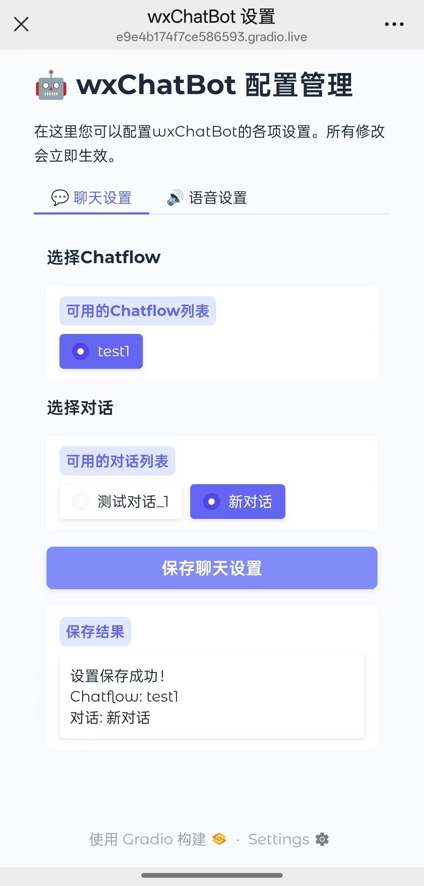

# wxChatBot

<div align="center">
  <a href="../../README.md">中文</a> | 
  <a href="README.md">English</a>
</div>

<div align="center">


</div>

<p align="center">wxChatBot is a powerful WeChat-based intelligent chatbot built on Dify and Gewechat. By integrating the Dify AI platform, it provides efficient and intelligent message processing and automatic reply services. It supports ChatFlow for customizing AI job tasks, comes with native permanent memory, supports GPT-SoVITS custom voice, and can send WeChat voice bubbles.</p>

<div align="center" style="display: flex; justify-content: center; flex-wrap: nowrap; gap: 5px; max-width: 100%; overflow-x: auto;">
  
  
  
</div>
<p align="center">WeChat Chat Demo | ChatFlow Configuration Interface | Voice Settings Interface</p>


## ✨ Features

### 🤖 Dify Integration
- Supports Dify's ChatFlow functionality, providing capabilities from Agent building to AI workflow orchestration, RAG retrieval, model management, etc.
- Easily build and operate generative AI native applications; theoretically, any features supported by Dify can be integrated into this project
- Native support for permanent memory and local knowledge base retrieval
- Support for custom plugins, custom function calls, and other extensions

### 📱 WeChat Integration
- Seamlessly connects with personal WeChat, easily integrating with the existing WeChat ecosystem
- Supports text and voice replies (native voice bubbles, not in file form)
- Supports intelligent processing of group chat and private chat messages
- Access the management interface through simple instructions (such as sending `#setting`)

### 🔊 Voice Features
- Based on GPT-SoVITS technology, supports customizing voice models
- Requires only a small amount of voice data to highly restore voice characteristics
- Supports voice message to text conversion and text to speech synthesis
- Configurable voice parameters for personalized voice experience

### ⚙️ System Features
- Web management interface developed with Gradio for easy configuration
- Uses Gradio's share=True mode, allowing remote access to the configuration interface without a public IP
- Plugin architecture, easy to extend and develop
- Comprehensive logging and monitoring system

## 🚀 Quick Start

### Requirements
- Python 3.11+
- A WeChat account linked to your ID (preferably with a wallet set up with at least 1 yuan, recommended to run on a dedicated device)
- Dify AI environment
- Gewechat Docker environment

### Installation Steps

1. Clone the repository
```bash
git clone https://github.com/yourusername/wxChatBot.git
cd wxChatBot
```

2. Install dependencies
```bash
pip install -r requirements.txt
```

3. Configure
```bash
# Copy the configuration template and modify it
cp config.example.json config.json
# Edit config.json with the necessary information
```

4. Start the service
```bash
python main.py
```

## 📄 License

This project is licensed under the MIT License. See the [LICENSE](../../LICENSE) file for more details.

## 📜 Disclaimer
- This project is for technical research and learning exchange only
- Prohibited for use in any illegal or unethical scenarios
- Generated content does not represent the developer's position or views
- Users are responsible for their own actions
- Developers are not responsible for any issues arising from the use of this project

---

<p align="center">If this project is helpful to you, please consider giving it a star ⭐️</p> 