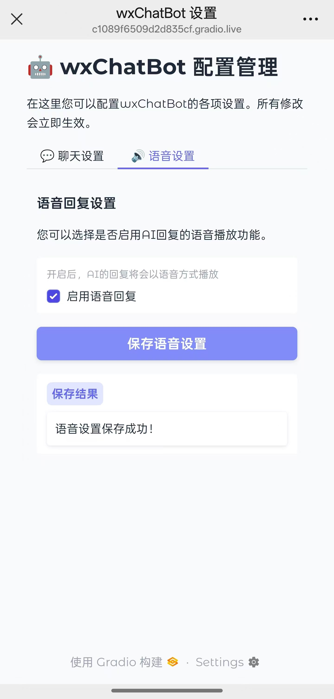
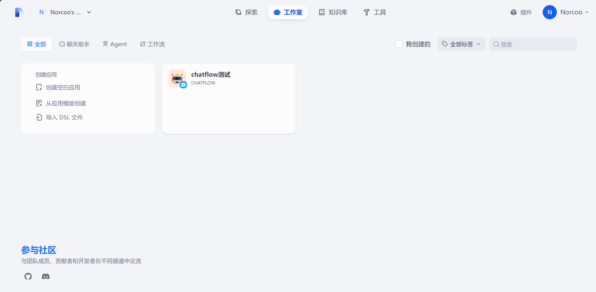
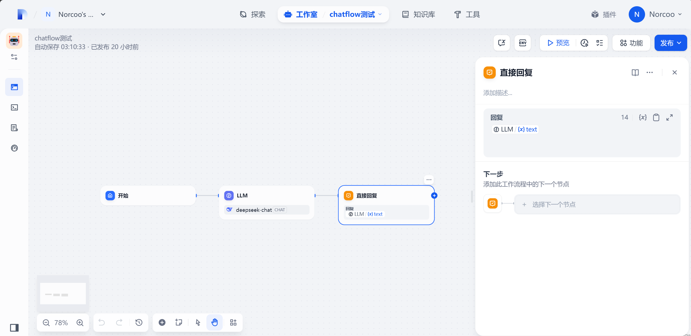
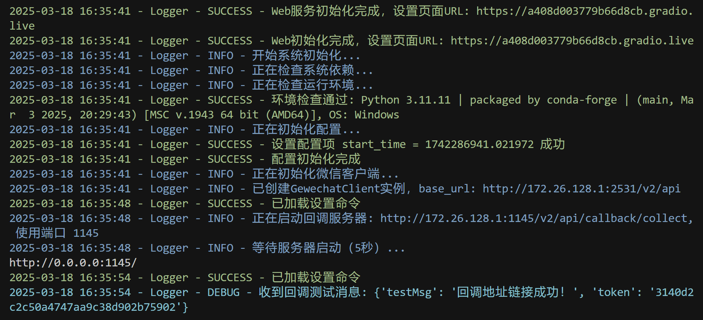

# wxChatBot

<div align="center">
  <a href="../cn/README.md">中文</a> | 
  <a href="README.md">English</a>
</div>

<div align="center">


</div>

<p align="center">wxChatBot is an intelligent chatbot project based on Dify and Gewechat. It provides efficient, intelligent message processing and automatic reply services through integration with the Dify AI platform. It supports ChatFlow for custom AI task orchestration, has built-in permanent memory functionality, supports GPT-SoVITS custom voice, and can send native WeChat voice bubbles.</p>

<div align="center" style="display: flex; justify-content: center; flex-wrap: nowrap; gap: 10px; max-width: 100%; overflow-x: auto;">
  
  
  
</div>
<p align="center"><b>WeChat Chat Demo | ChatFlow Configuration Interface | Voice Settings Interface</b></p>

## 👋 Introduction

Hello! This project was initially inspired by [dify-on-wechat](https://github.com/hanfangyuan4396/dify-on-wechat).

During deployment, I discovered several areas that needed improvement:
- Limited support for ChatFlow functionality
- Unstable WeChat callback connection for local deployment (especially without a public IP)
- Voice models could only call large company APIs, making voice customization difficult

So I integrated the GPT-SoVITS project, implementing custom voice functionality. This allows users to customize their own voice according to their needs.

Plans for future additions include:
- 📄 Document upload and intelligent Q&A
- 🎬 Video and image recognition processing
- 🎨 Multimedia content generation

Theoretically, all functions supported by Dify can be integrated. This project can become:
- 📚 A dedicated knowledge base assistant
- 📝 A personal life management tool
- 📊 A data analysis consultant

This is mainly thanks to Dify, a powerful open-source project that handles complex AI processing, while this project focuses on receiving and sending results.

I hope this project is also relatively beginner-friendly, though it currently does require some technical foundation. If you successfully deploy it, I hope you'll learn useful knowledge from it.

Let's explore the possibilities of AI applications together!

## ✨ Features

### 🤖 Dify Integration
- Supports Dify's ChatFlow functionality, providing Agent construction, AI workflow orchestration, RAG retrieval, model management, and more
- Simplifies the building and operation of generative AI applications, with most Dify functions available for integration
- Built-in permanent memory and local knowledge base retrieval
- Supports plugins and custom function extensions

<div align="center">
  
  <p><b>Dify Homepage</b></p>
  
  
  <p><b>Model Configuration Interface</b></p>
  
  
  <p><b>ChatFlow Workflow Configuration</b></p>
</div>

### 📱 WeChat Integration
- Seamlessly connects to personal WeChat, easily accessing the WeChat ecosystem
- Supports text and voice replies (native voice bubbles, not file format)
- Access management interface through simple commands (like `#settings`)

### 🔊 Voice Functionality
- Based on GPT-SoVITS technology, supports custom voice models
- Minimal voice samples needed to highly restore voice characteristics
- Supports voice-to-text and text-to-voice conversion
- Configurable voice parameters for personalized voice experience

### ⚙️ System Features
- Web management interface based on Gradio, simple and intuitive configuration
- Supports Gradio's share=True mode, allowing remote access without a public IP
- Clear project structure, facilitating customization and secondary development
- Complete logging and monitoring system

## 📁 Project Structure

```
wxChatBot/
├── Core/                  # Core function modules
│   ├── bridge/            # Communication bridge layer
│   ├── commands/          # Command system
│   ├── difyAI/            # Dify AI integration
│   ├── factory/           # Service factory
│   ├── voice/             # Voice processing module
│   └── web/               # Web management interface
├── gewechat/              # WeChat API integration
│   ├── api/               # API interface encapsulation
│   ├── util/              # Utility interface layer
│   └── data/              # Data storage
├── voice_model/           # Voice model files
├── logs/                  # Log files
├── tmp/                   # Temporary file directory
├── config.py              # Configuration management
├── main.py                # Main program entry
├── config.example.json    # Configuration file example
└── requirements.txt       # Project dependencies
```

## 🚀 Quick Start

### Environment Requirements
- Python 3.11+
- A verified WeChat account (recommended to enable wallet functionality with a small balance, more stable when run on a dedicated device)
- Dify Docker environment
- Gewechat Docker environment

### Video Tutorial
- Currently in production, stay tuned

### Installation Steps

#### 1. Clone Repository
```bash
git clone https://github.com/yourusername/wxChatBot.git
cd wxChatBot
```

#### 2. Install Dependencies
```bash
pip install -r requirements.txt
```

#### 3. Modify Configuration File (see configuration details below)
```bash
# Edit config.json with necessary information
config.json
```

#### 4. Build Dify via Docker (reference: [Dify](https://github.com/langgenius/dify))
```bash
git clone https://github.com/langgenius/dify.git
cd dify
cd docker
cp .env.example .env
docker compose up -d
```

#### 5. Build GeweChat via Docker (reference: [Gewechat](https://github.com/Devo919/Gewechat))
##### 5.1 Pull Image
```bash
docker pull registry.cn-hangzhou.aliyuncs.com/gewe/gewe:latest
docker tag registry.cn-hangzhou.aliyuncs.com/gewe/gewe gewe
```

##### 5.2 Run Image Container
```bash
mkdir -p /root/temp
docker update --restart=always gewe
docker run -itd -v /root/temp:/root/temp -p 2531:2531 -p 2532:2532 --privileged=true --name=gewe gewe /usr/sbin/init
```

##### 5.3 Set Container to Run at Startup
```bash
docker update --restart=always gewe
```

#### 6. Start the Main Program
```bash
python main.py
```

After successful startup, the console output looks like this:
<div align="center">

<p><b>System Startup Interface</b></p>
</div>


## ⚙️ Configuration Details

For first-time running, you need to modify the `config.json` file. Main configuration items include:

```json
{
    "master_name": "", // Your WeChat account name (note: this is the account name, not the nickname; recommend using a name that's not easily duplicated)
    "dify_api_base": "http://localhost/v1", // Dify address, generally doesn't need modification
    "gewechat_base_url": "http://your_local_ip:2531/v2/api", // Replace your_local_ip with your computer's IP address
    "gewechat_token": "", // For first application creation, leave empty, will be filled automatically
    "gewechat_app_id": "", // For first application creation, leave empty, will be filled automatically
    "gewechat_callback_url": "http://your_local_ip:1145/v2/api/callback/collect", // Generally doesn't need changing
    "server_host": "localhost", // Probably doesn't need modification
    "settings_url": "", // Automatically generated
    "GPT-SoVITS_url": "http://127.0.0.1:9880", // GPT-SoVITS url, default is usually fine
    "text_language": "ja", // Language of voice sent by model (if other than Chinese, need to modify prompts in Dify). Common ones: Chinese(zh), English(en), Japanese(ja)
    "call_back_success_falg": false, // If no response after sending messages post-login, set this to false to log in again. Remember to change to true after successful login
    "is_remote_server": false, // Whether it's a remote server; for local deployment, set to false
    "debug_mode": true, // Can be left unchanged
    "log_level": "DEBUG", // Can be left unchanged
    "start_time": 1742287344.8490422 // Automatically generated
}
```

> 💡 **Tip**: Refer to the `config.example.json` in the project for a complete configuration example.


## ❗Important Notes

### 💡 WeChat Callback Configuration
- On first run, the system will automatically configure the Gewechat callback address
- New devices may automatically disconnect around midnight the next day (WeChat security mechanism)
- Solution:
  1. Set `call_back_success_falg` to `false` in `config.json`
  2. Scan the QR code to log in again
  3. Change `call_back_success_falg` back to `true` after successful login
- If you don't mind scanning each time, you can keep it as `false` to avoid callback address issues

### 🛠️ Environment Dependencies
- **Dify Environment**: Must ensure Dify is correctly deployed, this is the foundation for using large model capabilities
- **GPT-SoVITS**: If voice functionality is needed, complete deployment first
  - Windows users recommended to use [GPT-SoVITS Integration Package](https://github.com/RVC-Boss/GPT-SoVITS?tab=readme-ov-file)
  - Other systems please refer to official documentation for deployment
- **Local Models**: Supports using LM Studio or Ollama to deploy local models
  - Select corresponding options in the Dify model configuration interface
  - Can be deeply customized according to needs

### 📦 FFmpeg Installation Guide
Choose the appropriate installation method for your operating system:

<details>
<summary><b>Windows System</b></summary>

```bash
# Method 1: Using Anaconda
conda install -c conda-forge ffmpeg

# Method 2: Using Chocolatey
choco install ffmpeg
```
</details>

<details>
<summary><b>Linux System</b></summary>

```bash
# Ubuntu/Debian
sudo apt update && sudo apt install ffmpeg

# CentOS/RHEL
sudo yum install ffmpeg
```
</details>

<details>
<summary><b>macOS System</b></summary>

```bash
# Using Homebrew
brew install ffmpeg
```
</details>

> ⚠️ **Important Note**:
> - Recommended to use Anaconda environment, tested to be simpler for installation
> - After installation, ensure FFmpeg is added to system environment variables
> - If you encounter "path does not exist" error, check environment variable configuration
> - Windows users can add FFmpeg directory to the Path system variable

## 📊 Main Dependencies

| Package | Version | Purpose |
|-------|------|------|
| `gradio` | 5.21.0 | Web interface framework for building settings pages |
| `web.py` | 0.62 | Web service framework, handles callbacks and API requests |
| `pyngrok` | 7.2.3 | Intranet penetration tool for remote access |
| `requests` | 2.32.3 | HTTP request library for communicating with various services |
| `ffmpeg-python` | 0.2.0 | Audio format conversion, processes voice messages |
| `pilk` | 0.2.4 | WeChat voice encoding processing |
| `pysilk` | 0.0.1 | SILK format audio processing |
| `qrcode` | 7.4.2 | QR code generation for WeChat login |
| `coloredlogs` | 15.0.1 | Log beautification, provides colored log output |
| `tqdm` | 4.67.1 | Progress bar display, optimizes user experience |

> 💡 **Installation Tip**:
> - Recommended to use Anaconda environment for dependency installation:
>   ```bash
>   conda create -n wxchatbot python=3.11
>   conda activate wxchatbot
>   # Ensure you're in the project path
>   pip install -r requirements.txt
>   ```
> - Some dependencies (like gradio) will automatically install other necessary packages
> - Ensure the system has FFmpeg installed (refer to installation guide above)

## 🚀 Development Plan

### Near-term Plans
- [x] Improve ChatFlow-related functionality
- [x] Optimize Web settings interface
- [x] WeChat voice sending toggle
- [ ] Official release of V1.0.0 version
- [ ] Docker one-click deployment
- [ ] Video tutorial

### Long-term Plans
- [ ] Configurable proactive message sending functionality
- [ ] User-configurable (customizable) multiple message sending within a certain time period, with Dify processing them all at once
- [ ] Batch operations (for instructions requiring multiple executions)
- [ ] Enhanced web-side functionality (support for creating new conversations, deleting conversations, modifying prompts, etc.)
- [ ] Emoji sending
- [ ] Group chat support
- [ ] Support for document upload and processing
- [ ] Support for video, image recognition, etc.
- [ ] User voice message sending
- [ ] QQ port
- [ ] Long text web Markdown rendering


## ❤️ Sponsorship Support

### 💝 Support Me
Your support is the driving force for continuously improving this project!

<div align="center">
🎯 Your support will be used for: 🎓 Creating open-source tutorials and documentation · 💡 Developing more practical features · 🌍 Building the open-source community · 🔥 Exploring new AI application possibilities
</div>

<div align="center" style="display: flex; justify-content: center; flex-wrap: nowrap; gap: 10px; max-width: 100%; overflow-x: auto;">
  
  
</div>
<p align="center"><b>WeChat Pay | Alipay</b></p>

### 🔒 Sponsorship Plan

<table>
  <thead>
    <tr>
      <th width="33%">🎯 Basic Services</th>
      <th width="33%">🌟 Advanced Services</th>
      <th width="33%">💎 Exclusive Services</th>
    </tr>
  </thead>
  <tbody>
    <tr>
      <td>
        <div style="padding: 5px 0;">
          📱 Private deployment solutions<br>
          🔧 Remote installation and configuration guidance<br>
          💻 Problem solving and troubleshooting
        </div>
      </td>
      <td>
        <div style="padding: 5px 0;">
          🤖 AI model private deployment and tuning<br>
          🎨 Custom dialogue processes and scenarios<br>
          📊 Dedicated knowledge base construction
        </div>
      </td>
      <td>
        <div style="padding: 5px 0;">
          📘 In-depth source code analysis<br>
          🛠️ Project secondary development technical consultation<br>
          💡 Solution application customization
        </div>
      </td>
    </tr>
  </tbody>
</table>

<div align="center" style="margin: 20px 0; padding: 10px; background-color: #f8f9fa; border-radius: 5px;">
  <p><b>💼 Business cooperation/sponsorship consultation:</b> WeChat <code>N19880667051</code> (Note: wxChatBot)</p>
</div>

## 💬 Core Discussion Groups

| Group Type | Group Number | Status |
|--------|------|------|
| ✨ Discussion Group | 953715009 | ✅ Open |
| 🎁 Sponsor Group | 1040728529 | ✅ Open |

## 🤝 Contribution Guide

Thank you for your interest in the project! We welcome contributions in various forms.

### 🌟 Ways to Contribute

1. 🐛 **Issue Reporting**
   - Describe the problem in detail
   - Provide reproduction steps and relevant logs
   - Specify the operating environment and related configuration

2. 💡 **Feature Suggestions**
   - Describe the purpose and application scenarios of the new feature
   - Provide design ideas or reference implementations
   - Share thoughts during usage

3. 📝 **Documentation Improvements**
   - Correct errors in documentation
   - Supplement installation and configuration instructions
   - Add usage examples and best practices
   - Translate documentation to other languages

4. 💻 **Code Contributions**
   - Fix known bugs
   - Develop new features
   - Optimize performance
   - Refactor code structure

### 🎯 Development Guide

- Detailed development guidelines will be provided after the project code is perfected

### 🔄 Update Log

**2025-03-19**
- Improved README document content and layout

**2025-03-17**
- Optimized image layout, added English documentation support
- Added configuration file examples
- Added project introduction and sample images
- GPT-SoVITS connection successful, implemented custom voice generation
- Implemented WeChat voice message sending functionality

**2025-03-12**
- Initial project framework setup
- Basic functionality implementation

## 📄 License

This project uses the MIT license. Please refer to the [LICENSE](../../LICENSE) file for details.

## 🌟 Acknowledgements

Thanks to the following open-source projects for their support:

- [Dify](https://dify.ai) - Provides powerful AI capability support
- [dify-on-wechat](https://github.com/hanfangyuan4396/dify-on-wechat) - Project inspiration source
- [Gewechat](https://github.com/Devo919/Gewechat) - WeChat interface implementation
- [GPT-SoVITS](https://github.com/RVC-Boss/GPT-SoVITS) - Voice synthesis technology support

## 📜 Project Statement
- This project is for technical research and learning exchange only
- Prohibited for use in any illegal or unethical scenarios
- Generated content does not represent the developer's stance or views
- Users are responsible for their own actions
- Developers are not responsible for problems arising from the use of this project

---

<div align="center">
  <p>If this project helps you, please consider giving it a star! ⭐️</p>
</div> 